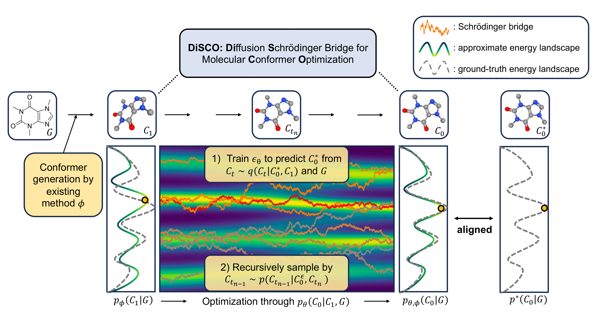

# DiSCO: Diffusion Schrödinger Bridge for Molecular Conformer Optimization
Official code of [DiSCO: Diffusion Schrödinger Bridge for Molecular Conformer Optimization](https://ojs.aaai.org/index.php/AAAI/article/view/29238) by D. Lee, D.Lee, D. Bang and S. Kim.

DiSCO is a novel diffusion framework designed for optimizing pre-generated molecular conformers. It utilizes the distribution of existing conformer generation method as informative prior of diffusion process to build a scalable and interpretable diffusion model.


## Installation
We provide conda environment (env.yml) used in our experiment.
```
git clone https://github.com/DanyeongLee/DiSCO.git
cd DiSCO

conda env create -f env.yml
conda activate disco
```
After setting up conda environment, please install our repo using:
```
pip install .
```

## Dataset
### Official Geom Dataset
The offical raw GEOM dataset is avaiable [[here]](https://dataverse.harvard.edu/dataset.xhtml?persistentId=doi:10.7910/DVN/JNGTDF).
### Preprocessed Dataset
We provide the preprocessed GEOM data, pre-generated conformers with baseline methods in [[google drive]](https://drive.google.com/drive/folders/1XgmgSMNpnb-XE15inieNnN0zKCr1xy0d?usp=sharing).


## Optimizing conformers using DiSCO
We provide the pretrained model for optimizing conformers generated with RDKit. It can directly handle the RDKit mol object.
```python
import torch
from rdkit import Chem
from rdkit.Chem import AllChem
from disco import DiSCO

# Embedding 10 conformers through ETKDG
mol = Chem.MolFromSmiles('C#CC(=O)[C@H](O)CCC')
mol = Chem.AddHs(mol)
AllChem.EmbedMultipleConfs(mol, 10)

# Optimizing through DiSCO
model = torch.load('deployed/fromrdkit-qm9.pt').to('cuda')
mol = model(mol) # resulting 'mol' object contains DiSCO-optimized conformers
```

## Training
### Using default arguments
We provide the default configuration files used in our experiments.
```
# for QM9 dataset
python disco/train.py +experiment=fromrdkit-qm9
```
```
# for DRUGS dataset
python disco/train.py +experiment=fromrdkit-drugs
```
### Custom arguments
You can also train your own customized model by overriding the arguments.
```
python disco/train.py +experiment=fromrdkit-drugs diffusion.noise_schedule.n_timesteps=100
```

## Note
This 'main' branch is for providing simple and easy-to-use code of DiSCO. For reproduction of all the results provided in our paper, please refer to the [reproduce](https://github.com/DanyeongLee/DiSCO/tree/reproduce) branch.

